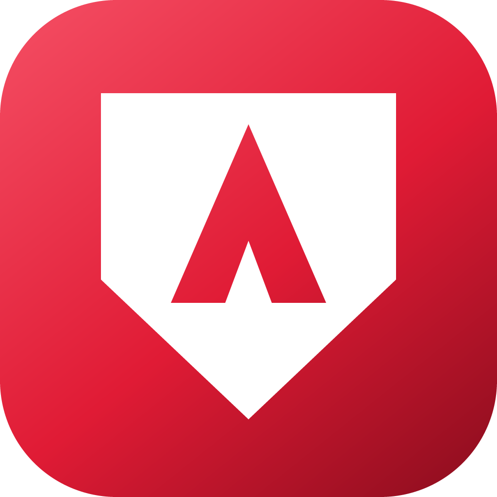
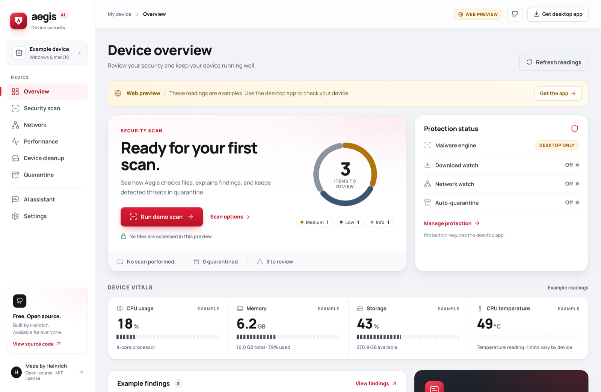
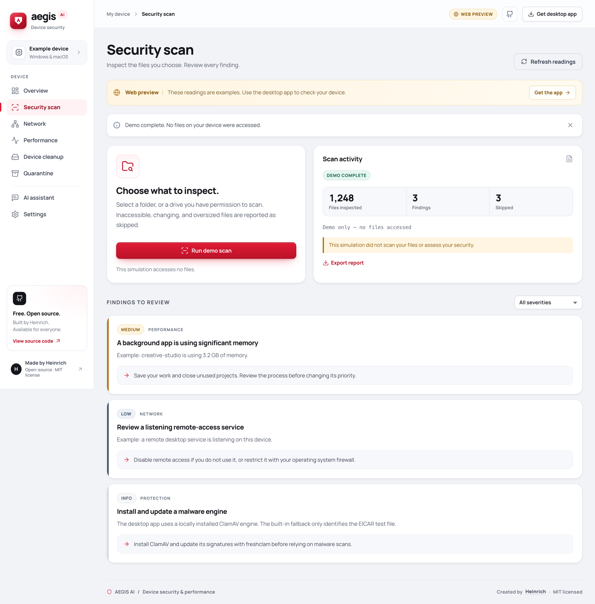
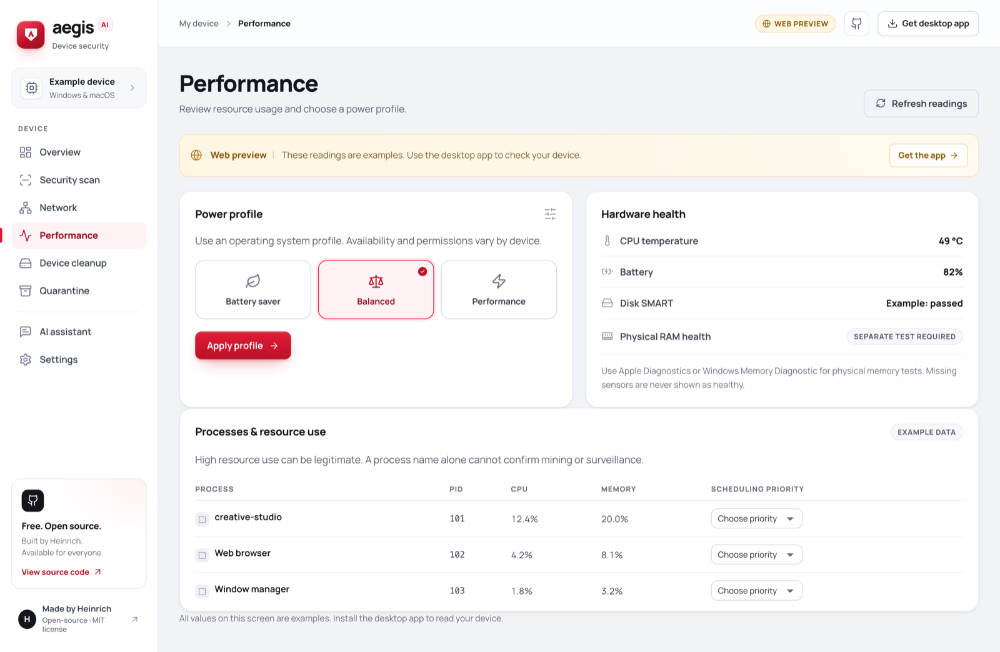
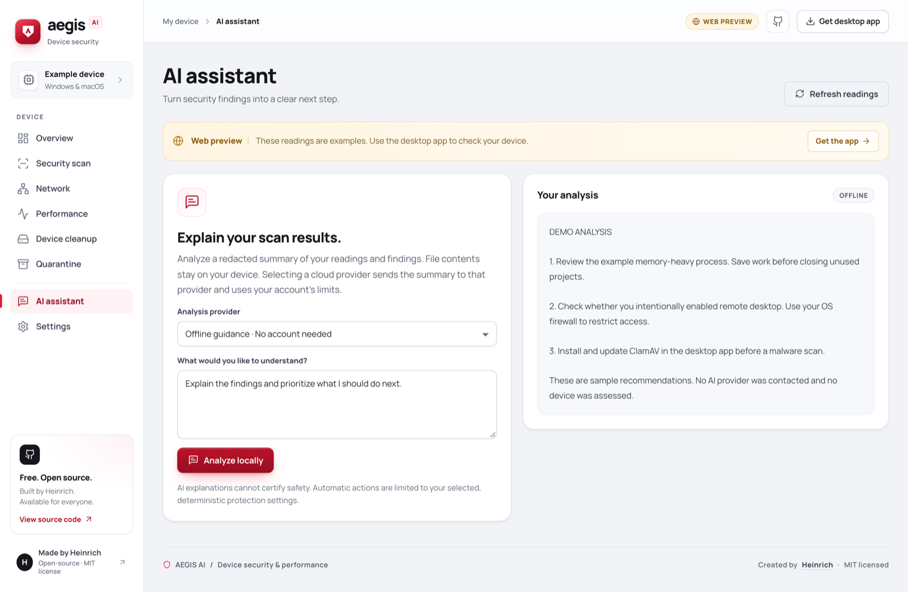
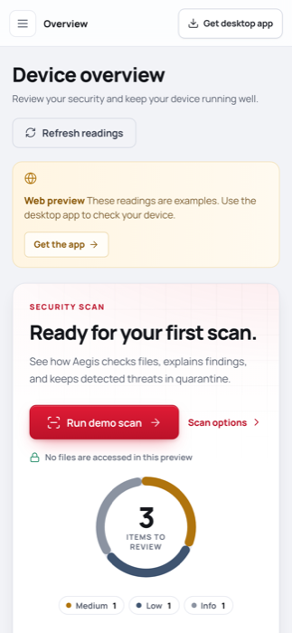

<div align="center">



# Aegis AI

**See what your device is doing — and decide what happens next.**

An open-source security and performance workbench for Windows and macOS.<br>
Created and maintained by **Heinrich**.

[](https://github.com/heinrichryodigital/aegis-ai/actions/workflows/build.yml)
[](LICENSE)
[](#quick-start)
[](#project-layout)

[**Live preview**](https://aegis-ai-heinrich.netlify.app) · [Releases](https://github.com/heinrichryodigital/aegis-ai/releases) · [Security policy](SECURITY.md) · [Contributing](CONTRIBUTING.md) · [MIT license](LICENSE)



</div>

## Contents

[Welcome](#welcome) · [Quick start](#quick-start) · [What works](#what-works) ·
[Getting started](#getting-started) · [A guided tour](#a-guided-tour) ·
[Scan and quarantine boundaries](#scan-and-quarantine-boundaries) ·
[Cleanup and performance](#cleanup-and-performance) ·
[AI providers and privacy](#ai-providers-and-privacy) ·
[Interface](#interface) · [Build and release](#build-release-and-web-hosting) ·
[Project layout](#project-layout) · [Contributing](CONTRIBUTING.md)

## Welcome

Most security tools tell you that you are "protected" and leave it there. Aegis is built on the
opposite instinct: **show the evidence, name the limits, and let you make the call.**

Point it at a folder and it inspects the files you chose. Every result explains what was found,
what that actually means, and what you might do about it. Nothing is deleted silently, nothing is
quarantined without your say-so, and no screen ever claims your device is "clean" — because no
scanner can honestly promise that.

**What Aegis is**

- A local workbench for inspecting files, connections, processes, and resource use.
- A reversible quarantine for confirmed file detections, with an audit trail.
- A plain-language explainer, offline by default, that turns findings into a next step.
- Free, MIT-licensed, and entirely open to read.

**What Aegis is not**

- Not a certified antivirus, and not a replacement for Microsoft Defender or macOS built-in
  protection. Keep those enabled.
- Not a real-time shield. It does not intercept files before they execute or run a kernel firewall.
- Not a guarantee. No scanner detects every virus, miner, surveillance tool, or vulnerability.

If you only take one thing from this page: Aegis is a second opinion you can read and verify, not a
badge that says everything is fine.

## Quick start

Pick whichever fits. Nothing here needs administrator credentials.

| I want to… | Do this |
| --- | --- |
| **Look around first** | Open the [live preview](https://aegis-ai-heinrich.netlify.app). It runs on clearly-labelled example data and never touches your device. |
| **Use it on my device** | Download a build from [Releases](https://github.com/heinrichryodigital/aegis-ai/releases), then read [First use](#a-guided-tour). |
| **Build it myself** | `git clone` → `npm ci` → `npm run desktop`. Full steps in [Run from source](#run-from-source). |

```sh
git clone https://github.com/heinrichryodigital/aegis-ai.git
cd aegis-ai
npm ci
npm run desktop     # builds the UI and opens the desktop app
```

> **Heads up:** the browser preview cannot scan your computer, quarantine files, or change any
> system setting. That is a deliberate boundary, not a missing feature. Native actions live in the
> desktop app.

## What works

| Feature | Current implementation | Boundary |
| --- | --- | --- |
| Web dashboard | Interactive React preview with labeled example data | A website cannot inspect this device, quarantine files, or change OS settings. Native actions require the desktop app. |
| Manual file scan | User-selected folder; separate local ClamAV integration; built-in harmless EICAR test check | ClamAV and current signatures must be installed separately. Without them, the built-in check detects only the EICAR test file. |
| Quarantine | Reversible isolation for eligible current detections; optional automatic quarantine | Single-link regular files on the same filesystem as quarantine storage. Heuristic and potentially unwanted application findings are excluded. |
| Device diagnostics | CPU, memory, disk use, process resource use, battery charge, available temperature and SMART readings | Snapshots and heuristic findings; missing readings remain unavailable. RAM usage is not a physical-memory test. |
| Network review | This host's interfaces, connections, selected listening services, and OS firewall state | No subnet discovery, remote port scanning, exploit testing, packet interception, or router assessment. |
| Download watch | Watches additions/changes in Downloads and queues bounded folder scans | App must remain open. It does not block downloads or intercept files before execution. |
| Network watch | Notices a change in the default gateway address | App must remain open; a changed address can be normal, and an unchanged address does not establish network safety. |
| Cleanup | Preview eligible `.tmp`, `.temp`, and `.log` files at least seven days old, then send reviewed candidates to OS Trash | Specific personal folder only; protected locations, links, and changed files are excluded. Age and extension do not prove a file is disposable. |
| Power profiles | Select existing Windows balanced/performance/battery schemes when permitted; read Mac energy mode | macOS generally requires changing energy mode in System Settings. There is no universal High Power Mode or guaranteed speed increase. |
| Per-app tuning | Request low/normal/high scheduling priority for a verified same-user process on macOS or Windows | OS permissions can prevent changes. Windows uses BelowNormal/Normal/AboveNormal, never High or Realtime; its mutation path still needs native runtime validation. No CPU/RAM reservation or GPU overclocking. |
| AI explanations | Always-available offline rules; optional Codex or Claude Code CLI analysis | External analysis is user-initiated. Responses are displayed as advice and never executed as commands or remediation plans. |

Automatic remediation is limited to the quarantine setting. Cleanup, restoration, power changes, and process-priority changes require explicit user actions. Aegis does not silently install patches, delete suspicious applications, terminate processes, or alter firewall rules.

## Getting started

### Desktop download

Check [GitHub Releases](https://github.com/heinrichryodigital/aegis-ai/releases) for completed builds. The release workflow targets:

- Windows x64: NSIS `.exe` installer.
- macOS Apple Silicon (`arm64`): `.dmg` and `.zip`.
- macOS Intel (`x64`): `.dmg` and `.zip`.

Early builds are unsigned and macOS builds are not notarized. OS security warnings may appear. Review the source and release provenance; do not disable system-wide protections to install Aegis. Release checksums, when present, help verify downloaded file integrity but are not a publisher signature. If a release is not available, build from source below. A successful package build does not demonstrate compatibility with every OS version or device.

### Run from source

Use Node.js 22 and npm, matching CI. Clone the repository, then install dependencies:

```sh
git clone https://github.com/heinrichryodigital/aegis-ai.git
cd aegis-ai
npm ci
npm test
npm run desktop
```

`npm run desktop` builds the React interface and opens the local Electron application. Run it as your regular user. Aegis does not request administrator credentials or install a background service.

For the browser preview:

```sh
npm run dev
```

Open the localhost address printed by Vite. The browser uses example readings and simulated actions; it does not scan your computer. To preview a production web build, use `npm run build` followed by `npm run preview`.

### Install a malware engine

ClamAV is **not bundled**. Install it separately, configure its signature database updater, and verify that **Settings → Engines & integrations** recognizes it. Aegis invokes `clamscan` locally; it does not invoke Microsoft Defender, download signature updates, or manage ClamAV services.

On macOS, an existing Homebrew installation can install ClamAV:

```sh
brew install clamav
```

Follow the official [package instructions](https://docs.clamav.net/manual/Installing/Packages.html) to create `freshclam.conf` from the supplied sample if needed and remove/comment its `Example` line. Configuration paths depend on the package prefix; use `brew --prefix` to identify your installation. Aegis recognizes the usual Homebrew executable paths `/opt/homebrew/bin/clamscan` and `/usr/local/bin/clamscan`, plus the official macOS package location `/usr/local/clamav/bin/clamscan`. The official package requires its own configuration/database setup; consult [ClamAV installation](https://docs.clamav.net/manual/Installing.html#macos).

On Windows, use the official installer described in [ClamAV installation](https://docs.clamav.net/manual/Installing.html#windows). Aegis looks for `ClamAV\clamscan.exe` under `Program Files`; a portable copy in another folder is not automatically discovered. Follow [ClamAV configuration](https://docs.clamav.net/manual/Usage/Configuration.html) to create and configure `freshclam.conf` and the database location.

After configuration, update signatures using `freshclam` (`freshclam.exe` on Windows), then check `clamscan --version`. Keep updates current according to the official [signature update guide](https://docs.clamav.net/manual/Usage/SignatureManagement.html). The app reports the database date when the CLI provides it, and warns when it appears older than seven days or freshness is unknown. That warning is not an automatic update or a guarantee of coverage.

## A guided tour

New here? This is the order that makes sense on a first run.

### 1. Start on the Overview

Open the desktop app and press **Refresh readings**. The ring in the security panel counts the items
waiting for your review, split by severity — it is a count of findings, never a safety score. Below
it, **Device vitals** shows CPU, memory, storage, and temperature; the segmented bars turn amber
past 70% and crimson past 88%.

Anything that could not be read says so. A missing sensor is reported as unavailable and is never
shown as healthy.

### 2. Confirm your engine in Settings

Open **Settings → Engines & integrations**. ClamAV is not bundled — see
[Install a malware engine](#install-a-malware-engine). Without it, the built-in check identifies
only the harmless EICAR test file. This screen also tells you how fresh your signatures are.

### 3. Run your first scan



Go to **Security scan → Choose folder & scan** and pick one specific folder — start small, such as
Downloads. When it finishes you get three numbers: files inspected, findings, and skipped.

**Read the skipped count and the warnings even when the status says `complete`.** A bounded run
finishing is not the same as full device coverage.

Each finding carries a severity stripe down its left edge, the evidence behind it, and a
recommendation. A finding is a lead for you to review, not a verdict.

### 4. Quarantine only what you mean to

If a finding is an eligible, confirmed file detection, **Quarantine** moves it aside. It is
reversible: the original path, file identity, and SHA-256 are recorded, and **Quarantine → Review &
restore** puts it back — refusing to overwrite anything new at that path.

Turn on **Auto-quarantine** only if you want future eligible detections in the folders you scan or
watch moved automatically.

### 5. Review your network and processes



**Network** lists this host's interfaces, connections, and listening services. **Performance** shows
what is consuming resources and lets you request a power profile or a per-app scheduling priority.

High resource use is very often legitimate. A process name alone never proves mining or
surveillance — these screens give you leads to investigate, not conclusions.

### 6. Ask for an explanation



**AI assistant** turns your findings into prioritised next steps. It defaults to **offline
guidance** — deterministic local rules, no account, no network call.

Choosing a cloud provider instead sends a reduced, redacted summary through that tool's own CLI
login, and only after you confirm. File contents, paths, filenames, process names, and IP addresses
are excluded from that summary. Details in
[AI providers and privacy](#ai-providers-and-privacy).

### Works on a small screen too

<div align="center">

</div>


## Scan and quarantine boundaries

The scanner handles regular files under the selected folder. It skips symbolic links, redirected paths, private scanner storage, inaccessible entries, and files over 64 MiB. Each scan is bounded to 20,000 files, 100,000 enumerated entries, 4 GiB of file data, 32 directory levels, and approximately 20 minutes; engine work also has its own limits. Read warnings even when a scan's status is `complete`: completion of the bounded run is not complete device coverage.

ClamAV archive inspection is subject to engine limits and does not make encrypted content readable. Aegis does not inspect process memory, boot sectors, firmware, or kernel activity. Resource pressure and mining-related process names are leads for review, not proof of unauthorized mining or surveillance.

Quarantine records the original path, file identity, and SHA-256, checks the file again before moving it, and uses an atomic same-filesystem rename. Hard-linked files and changed files are refused. Cross-volume isolation is not supported, so a file on an external drive may need the operating system antivirus instead. Heuristic/PUA alerts do not qualify for automatic isolation; the harmless EICAR test file does, to exercise the workflow.

Restoration checks the stored payload and refuses to overwrite an existing destination. On platforms with Unix permission bits, restored files do not regain executable bits. If a record says recovery is required, preserve the quarantine directory and investigate before manually moving files. Quarantine is user-owned storage, not an encrypted vault or protection against malware already running as the same user.

## Cleanup and performance

Choose a specific personal folder and review the cleanup list before confirming. Cleanup excludes broad roots, the whole home folder, hidden directories, app bundles, application data, system locations, symbolic/hard links, and other protected paths. Only qualifying regular `.tmp`, `.temp`, and `.log` files are candidates; logs may still be valuable. The UI currently moves the reviewed candidate set together, so cancel if any candidate should be retained.

A preview is bounded to 200 candidates, 64 MiB per file, 256 MiB hashed data, 5,000 entries, 500 directories, eight levels, and approximately 20 seconds. Previews expire after 15 minutes. Before trashing, Aegis rechecks identity, age, paths, and contents. OS Trash is path-based; these checks reduce races but do not create a kernel-enforced deletion boundary. Recover files through Trash or Recycle Bin. Aegis does not empty it.

There is no registry sweeping, memory flushing, or automatic deletion of applications. High memory use alone is not defective RAM. SMART and temperature availability varies with hardware, permissions, bridges, and sensor support; use manufacturer/OS diagnostics for hardware testing. Power profiles and priority adjustments affect scheduling and energy policy, not hardware capabilities or guaranteed performance. Windows process tuning verifies ownership and process identity and refuses elevated/ambiguous requests; native Windows mutation behavior remains to be validated, so check the reported result instead of assuming a change succeeded.

## AI providers and privacy

The offline advisor uses deterministic local rules. It is not an on-device language model and works without an account or API key.

For cloud explanations, Aegis can reuse a **supported native CLI's own existing login**. It never extracts browser sessions, reads token stores directly, or copies credentials from another application. Being signed into an arbitrary browser chat or desktop app does not necessarily make a CLI available.

- **Codex / ChatGPT:** install the official Codex CLI or use a discoverable bundled native CLI, sign in with `codex login`, and check `codex login status`. The adapter verifies required CLI capabilities. Analysis uses an empty temporary working directory, read-only sandbox, ephemeral execution, and disabled shell, browser/computer, hooks, plugins, apps, and other execution-related features. It ignores user configuration and rules for that invocation. Codex remains a trusted local program: this is not an OS privacy sandbox or a verified deny-all-tools boundary. See [Codex authentication](https://learn.chatgpt.com/docs/auth) and [non-interactive mode](https://learn.chatgpt.com/docs/non-interactive-mode).
- **Claude Code:** install a supported native CLI and sign in using `claude auth login`. Required flags include bare/restricted execution, no built-in tools, denied tools, an empty strict MCP configuration, and no session persistence. Older CLIs without verified controls are unavailable. See the official [Claude Code CLI reference](https://code.claude.com/docs/en/cli-reference).
- **Antigravity:** unavailable in this version because no supported tool-free headless interface has been verified. Aegis does not work around this by extracting a login session.

No background AI analysis occurs. After you select a cloud provider and confirm **Send summary & analyze**, its CLI receives fixed-schema counts, severity/category values, derived signal labels, numeric resource metrics, and your redacted question. Raw report paths, filenames, process names, IP addresses, hostnames, raw evidence, and file contents are omitted from that report summary. Question redaction is best effort; do not put secrets or confidential file contents into the question. Provider account limits, availability, and data policies still apply. Aegis does not promise free or unlimited inference.

Provider responses are displayed as text. They do not authorize shell execution, quarantine, deletion, or OS changes. Aegis has no API-key entry form and does not forward inherited OpenAI/Anthropic API-key environment variables to these adapters.

The app does not implement its own telemetry or a report-upload service. External CLIs, your web host, and dependency/update tools have their own behavior and policies. A manual **Export current report** saves the full report, which can include device names, paths, process information, and network addresses. Review exports before sharing; they are not the same as the reduced AI summary.

Local preferences are stored in Electron's application user-data directory. Quarantine uses its `security/quarantine` subdirectory, with metadata and a local `security/quarantine-audit.jsonl` trail. Those records contain original paths and hashes. Keep this data private and do not commit it.

## Build, release, and web hosting

```sh
npm test
npm run build
```

Build desktop packages on the corresponding OS:

```sh
# macOS: Apple Silicon and Intel DMG/ZIP targets
npm run dist:mac

# Windows: x64 installer
npm run dist:win
```

Packages are written to `release/`. Code signing is intentionally unconfigured for this preview. Do not represent these artifacts as signed, notarized, independently audited, or certified.

The [GitHub Actions workflow](.github/workflows/build.yml) validates tests, TypeScript/web builds, and production dependency auditing; it then builds on Windows and macOS runners. A successfully completed `v*` tag workflow publishes installers and `SHA256SUMS.txt` to GitHub Releases. Check the workflow result and actual assets before announcing a release. Maintainers should smoke-test the packaged app on each target OS and architecture.

Netlify serves only the web preview. The included [netlify.toml](netlify.toml) sets Node 22, runs `npm run build`, and publishes `dist/` with security headers and SPA routing. The public preview is deployed at [aegis-ai-heinrich.netlify.app](https://aegis-ai-heinrich.netlify.app). Desktop binaries belong in GitHub Releases, not the browser's native bridge.

**Automatic GitHub-to-Netlify deployment is not configured**, so merging to `main` does not update
the live preview. Publish a new build explicitly:

```sh
npm run build
npx netlify-cli deploy --prod --dir=dist
```

The first run opens a browser to authorise the Netlify CLI. The site ID is already stored in
`.netlify/state.json`. To drop the manual step instead, connect the repository in the Netlify
dashboard under **Site configuration → Build & deploy**.

## Interface

The UI is a deliberate design system rather than a theme, and the rules are worth knowing before you
change it:

- **Crimson is rationed.** Red means exactly three things — product identity, the primary action,
  and genuine danger. Protection states use green, amber, and slate so that red never loses its
  meaning through overuse.
- **Readings use tabular figures.** Every number is monospaced-by-width so columns line up as values
  change. This is what separates an instrument from a marketing page.
- **Meters are segmented.** Vitals render as discrete ticks, not smooth progress bars, and shift
  graphite → amber → crimson at 70% and 88%.
- **Severity reads at the edge.** Findings carry a coloured stripe before a single word is parsed.
- **One dark surface.** The AI panel is the only dark card in the product. A single deliberate
  contrast break gives the page a spine; a grid of identical white cards does not.
- **Accessible by construction.** Every text colour is checked against its real background; the
  palette clears WCAG AA on white, canvas, and inset grounds. Keyboard focus is a 2px crimson ring
  that never reshapes the control it sits on.

Tokens live at the top of [`src/styles.css`](src/styles.css). Change the token, not the component.
The app icon is generated from [`build/icon.svg`](build/icon.svg) by
[`build/render-icon.py`](build/render-icon.py), which preserves the transparent corners that a
Quick Look render flattens.

## Project layout

```text
src/                    React + TypeScript UI and labeled demo data
desktop/main.cjs        Electron window, IPC validation, confirmations, watchers
desktop/preload.cjs     Narrow renderer bridge
desktop/scanner.mjs     Bounded file scanning and reversible quarantine
desktop/diagnostics.mjs Host inventory, exposure review, power and priority controls
desktop/cleanup.mjs     Reviewed temporary-file cleanup through OS Trash
desktop/providers.mjs   Reduced AI summaries and native CLI adapters
desktop/*.test.mjs      Node tests for native behavior and boundaries
.github/workflows/      Validation and unsigned release packaging
```

Created and maintained by **Heinrich**. Aegis code is available under the [MIT license](LICENSE); dependencies and external antivirus/AI tools retain their own licenses and terms.
